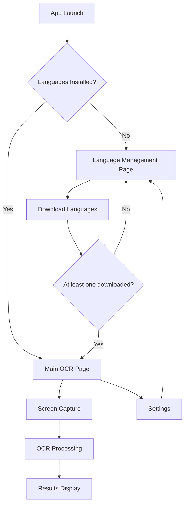

# OCR Screen Capture - Manual Language Management System

## 1. Product Overview
Restructure the OCR Screen Capture application to implement a manual language download system that eliminates automatic network requests during OCR processing. Users will manage language packs through a dedicated interface, ensuring offline functionality and better user control over installed languages.

- **Problem to solve**: Eliminate network-related errors in packaged Electron apps by removing automatic language downloads during OCR processing
- **Target users**: Users who need reliable offline OCR functionality with predictable language availability
- **Product value**: Provides stable, offline-first OCR experience with transparent language management

## 2. Core Features

### 2.1 User Roles
| Role | Registration Method | Core Permissions |
|------|---------------------|------------------|
| App User | Direct app installation | Can download language packs, configure OCR settings, perform OCR operations |

### 2.2 Feature Module
Our restructured OCR application consists of the following main pages:
1. **Language Management Page**: language pack table, download controls, installation status
2. **Main OCR Page**: screen capture interface, OCR processing, results display
3. **Settings Page**: language preferences, OCR configuration, app settings

### 2.3 Page Details

| Page Name | Module Name | Feature description |
|-----------|-------------|---------------------|
| Language Management Page | Language Pack Table | Display available languages with flags, names, file sizes, and installation status. Show download/delete buttons for each language |
| Language Management Page | Download Manager | Handle individual language downloads with progress bars, error handling, and completion notifications |
| Language Management Page | Installation Validator | Check for minimum language requirements (at least one language must be installed) before allowing OCR usage |
| Main OCR Page | Screen Capture | Provide area selection and full-screen capture modes with visual feedback |
| Main OCR Page | OCR Processing | Process captured images using only locally installed language packs |
| Main OCR Page | Language Selector | Show dropdown with only installed languages for OCR processing |
| Main OCR Page | Results Display | Show extracted text with confidence scores and copy-to-clipboard functionality |
| Settings Page | Language Preferences | Manage default OCR language selection from installed languages only |
| Settings Page | Storage Management | Display storage usage by language packs and provide cleanup options |
| Settings Page | App Configuration | Configure shortcuts, auto-copy settings, and capture modes |

## 3. Core Process

**First Launch Flow:**
1. User opens app for the first time
2. App detects no language packs installed
3. Language Management page opens automatically
4. User sees table of available languages with download options
5. User must download at least one language pack to proceed
6. After successful download, user can access main OCR functionality

**Regular Usage Flow:**
1. User opens app with languages already installed
2. Main OCR page opens directly
3. Language selector shows only installed languages
4. User can access Language Management via settings menu

**Language Management Flow:**
1. User accesses Language Management from settings
2. View table showing all available languages and their status
3. Download new languages or delete existing ones
4. Changes immediately reflect in OCR language options

## 4. User Interface Design

### 4.1 Design Style
- **Primary colors**: #2563eb (blue), #1f2937 (dark gray)
- **Secondary colors**: #10b981 (green for success), #ef4444 (red for errors)
- **Button style**: Rounded corners with subtle shadows, hover effects
- **Font**: System fonts (SF Pro on macOS), sizes 14px-18px for body text
- **Layout style**: Clean card-based design with consistent spacing
- **Icons**: Use system icons and flag emojis for language identification

### 4.2 Page Design Overview

| Page Name | Module Name | UI Elements |
|-----------|-------------|-------------|
| Language Management Page | Language Pack Table | Table with columns: Flag, Language Name, File Size, Status, Actions. Use green checkmarks for installed, blue download buttons for available, red delete buttons for installed |
| Language Management Page | Download Progress | Progress bars with percentage, cancel buttons, and status messages. Use blue progress bars with smooth animations |
| Main OCR Page | Capture Interface | Overlay selection tool with dashed borders, capture buttons with camera icons, keyboard shortcut hints |
| Main OCR Page | Language Selector | Dropdown menu showing only installed languages with flag icons, positioned prominently in the interface |
| Settings Page | Configuration Panels | Grouped settings in cards with clear labels, toggle switches for boolean options, and descriptive help text |

### 4.3 Responsiveness
Desktop-first application optimized for macOS with consistent window sizing and proper scaling for different screen densities. Touch interaction not required as this is a desktop utility application.

## 5. Technical Requirements

### 5.1 Language Pack Management
- Store language packs in user data directory for persistence
- Implement download progress tracking and cancellation
- Validate downloaded files before marking as installed
- Provide storage usage information and cleanup options

### 5.2 Offline-First Architecture
- No network requests during OCR processing
- All language data must be locally available
- Graceful handling of missing language files
- Clear error messages for language-related issues

### 5.3 User Experience
- Prevent OCR usage until at least one language is installed
- Show clear download progress and completion status
- Immediate reflection of language changes in OCR options
- Persistent storage of user language preferences

### 5.4 Error Handling
- Network error handling during downloads with retry options
- File corruption detection and re-download capabilities
- Clear user messaging for all error states
- Fallback options when preferred languages are unavailable