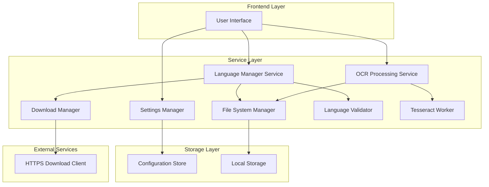
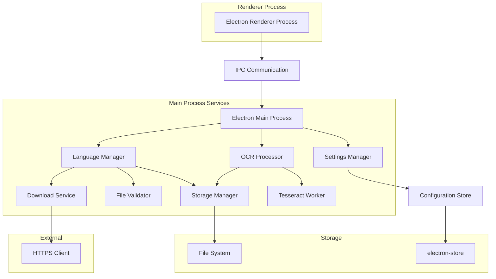
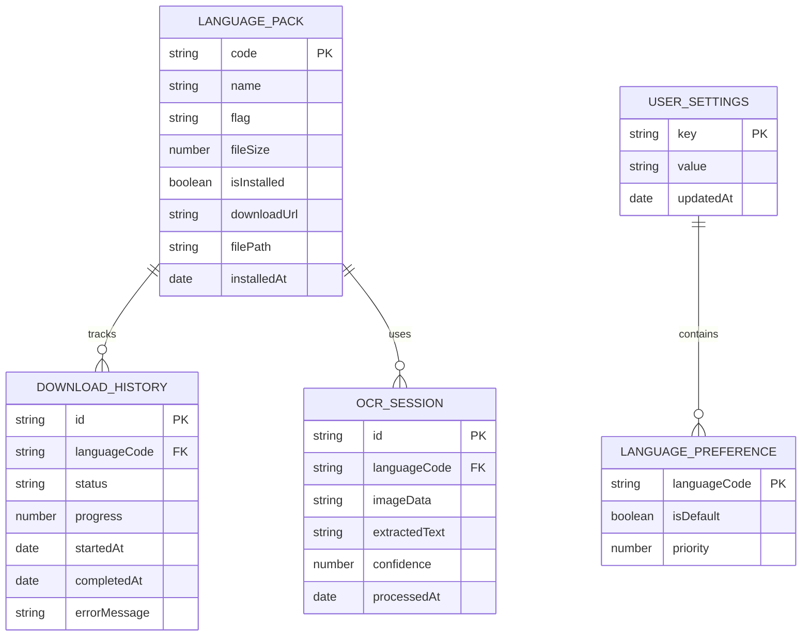

# OCR Screen Capture - Manual Language Management Technical Architecture

## 1. Architecture Design



## 2. Technology Description

- Frontend: Electron + HTML5 + CSS3 + JavaScript ES6+
- Backend: Node.js (Electron Main Process)
- Storage: File System + electron-store for configuration
- OCR Engine: Tesseract.js with local language packs
- Download: Node.js HTTPS module

## 3. Route Definitions

| Route | Purpose |
|-------|---------|
| /language-management | Language pack download and management interface |
| /main-ocr | Main OCR capture and processing interface |
| /settings | Application configuration and preferences |
| /first-setup | Initial language setup wizard for new users |

## 4. API Definitions

### 4.1 Core API

Language Management APIs
```
GET /api/languages/available
```
Response:
| Param Name | Param Type | Description |
|------------|------------|-------------|
| languages | Array<Language> | List of available language packs |

Language Object:
```typescript
interface Language {
  code: string;        // Language code (e.g., 'eng', 'khm')
  name: string;        // Display name (e.g., 'English', 'Khmer')
  flag: string;        // Flag emoji
  fileSize: number;    // File size in bytes
  isInstalled: boolean; // Installation status
  downloadUrl: string; // Download URL
}
```

```
POST /api/languages/download
```
Request:
| Param Name | Param Type | isRequired | Description |
|------------|------------|------------|-------------|
| languageCode | string | true | Language code to download |

Response:
| Param Name | Param Type | Description |
|------------|------------|-------------|
| success | boolean | Download initiation status |
| downloadId | string | Unique download identifier |

```
GET /api/languages/installed
```
Response:
| Param Name | Param Type | Description |
|------------|------------|-------------|
| languages | Array<string> | List of installed language codes |

```
DELETE /api/languages/:code
```
Response:
| Param Name | Param Type | Description |
|------------|------------|-------------|
| success | boolean | Deletion status |

OCR Processing APIs
```
POST /api/ocr/process
```
Request:
| Param Name | Param Type | isRequired | Description |
|------------|------------|------------|-------------|
| imageData | string | true | Base64 encoded image data |
| language | string | true | Language code for OCR |

Response:
| Param Name | Param Type | Description |
|------------|------------|-------------|
| text | string | Extracted text |
| confidence | number | OCR confidence score |

## 5. Server Architecture Diagram



## 6. Data Model

### 6.1 Data Model Definition



### 6.2 Data Definition Language

Language Pack Storage (File System)
```javascript
// Language pack directory structure
userData/
├── languages/
│   ├── eng.traineddata
│   ├── khm.traineddata
│   ├── khm+eng.traineddata
│   └── manifest.json
├── downloads/
│   └── temp/
└── config/
    └── settings.json
```

Configuration Store (electron-store)
```javascript
// settings.json structure
{
  "installedLanguages": ["eng", "khm"],
  "defaultLanguage": "eng",
  "downloadDirectory": "/path/to/userData/languages",
  "autoCleanupDownloads": true,
  "maxConcurrentDownloads": 2,
  "ocrSettings": {
    "autoCopy": true,
    "showConfidence": true,
    "captureMode": "area"
  },
  "windowBounds": {
    "width": 800,
    "height": 600,
    "x": null,
    "y": null
  }
}
```

Language Manifest (JSON)
```javascript
// manifest.json - tracks installed languages
{
  "version": "1.0.0",
  "languages": {
    "eng": {
      "name": "English",
      "flag": "🇺🇸",
      "fileSize": 4963328,
      "installedAt": "2024-01-15T10:30:00Z",
      "checksum": "sha256:abc123...",
      "version": "4.1.0"
    },
    "khm": {
      "name": "Khmer",
      "flag": "🇰🇭", 
      "fileSize": 1847296,
      "installedAt": "2024-01-15T10:35:00Z",
      "checksum": "sha256:def456...",
      "version": "4.1.0"
    }
  },
  "lastUpdated": "2024-01-15T10:35:00Z"
}
```

Download Progress Tracking
```javascript
// In-memory download tracking
const downloadProgress = {
  "eng": {
    status: "downloading", // "pending", "downloading", "completed", "error"
    progress: 0.65,        // 0.0 to 1.0
    bytesDownloaded: 3225600,
    totalBytes: 4963328,
    startTime: Date.now(),
    errorMessage: null
  }
};
```

IPC Event Definitions
```javascript
// Main Process -> Renderer Process
ipcMain.handle('language-get-available', async () => { /* ... */ });
ipcMain.handle('language-get-installed', async () => { /* ... */ });
ipcMain.handle('language-download', async (event, languageCode) => { /* ... */ });
ipcMain.handle('language-delete', async (event, languageCode) => { /* ... */ });
ipcMain.handle('ocr-process', async (event, imageData, language) => { /* ... */ });

// Progress events
ipcMain.emit('download-progress', languageCode, progress);
ipcMain.emit('download-complete', languageCode, success);
ipcMain.emit('download-error', languageCode, error);
```