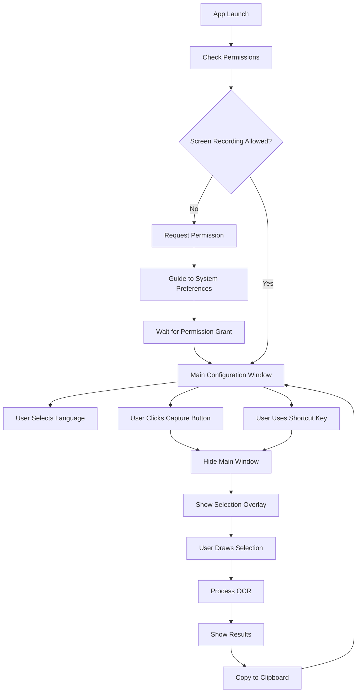

# OCR Screen Capture App - Product Requirements Document

## 1. Product Overview
A streamlined macOS desktop application that provides quick OCR (Optical Character Recognition) functionality through screen area capture with minimal configuration overhead.

The app solves the problem of extracting text from any part of the screen efficiently, targeting users who frequently need to digitize text from images, PDFs, or non-selectable content. The product delivers value through its simplicity, speed, and seamless integration with macOS workflows.

## 2. Core Features

### 2.1 User Roles
No user role distinction required - single-user desktop application.

### 2.2 Feature Module
Our OCR Screen Capture app consists of the following main pages:
1. **Main Configuration Window**: language settings, capture button, shortcut display, status indicators.
2. **Area Selection Overlay**: full-screen transparent overlay, selection rectangle, visual feedback, capture instructions.
3. **System Integration**: global shortcut handling, permission management, system tray (optional).

### 2.3 Page Details

| Page Name | Module Name | Feature description |
|-----------|-------------|---------------------|
| Main Configuration Window | Language Settings | Select OCR language from dropdown (English, Spanish, French, German, Chinese, Japanese, etc.) |
| Main Configuration Window | Capture Button | Large prominent button to initiate screen capture, hides main window when clicked |
| Main Configuration Window | Shortcut Display | Show current global shortcut key combination (default: Cmd+Shift+2) |
| Main Configuration Window | Status Indicator | Display current app status (Ready, Processing, Error) with visual feedback |
| Main Configuration Window | Results Display | Show extracted text in scrollable text area with copy functionality |
| Area Selection Overlay | Selection Rectangle | Draw selection area with mouse drag, show dimensions in real-time |
| Area Selection Overlay | Visual Feedback | Semi-transparent overlay with highlighted selection area |
| Area Selection Overlay | Instructions | Display capture instructions and cancel options (ESC key) |
| Area Selection Overlay | Capture Processing | Process selected area through OCR engine and return to main window |
| System Integration | Global Shortcuts | Register and handle Cmd+Shift+2 for quick capture from anywhere |
| System Integration | Permission Management | Request and handle macOS screen recording permissions |
| System Integration | Clipboard Integration | Automatically copy extracted text to system clipboard |

## 3. Core Process

**Main User Flow:**
1. User opens the app and sees the main configuration window
2. User selects preferred OCR language from dropdown
3. User clicks "Capture Area" button or uses global shortcut (Cmd+Shift+2)
4. Main window hides and full-screen selection overlay appears
5. User drags to select area for OCR processing
6. Selection overlay disappears and OCR processing begins
7. Main window reappears showing processing status
8. Extracted text appears in results area and copies to clipboard automatically
9. User can view results or initiate another capture

**Permission Flow (First Launch):**
1. App requests screen recording permission on macOS
2. User is guided to System Preferences to grant permission
3. App verifies permission and enables capture functionality

## 4. User Interface Design

### 4.1 Design Style
- **Primary Colors**: System blue (#007AFF) for primary actions, system gray (#8E8E93) for secondary elements
- **Secondary Colors**: Green (#34C759) for success states, red (#FF3B30) for errors, orange (#FF9500) for processing
- **Button Style**: Rounded rectangles with 8px border radius, subtle shadows, hover and active states
- **Font**: San Francisco (system font) with 16px for buttons, 14px for body text, 12px for labels
- **Layout Style**: Clean minimal design with generous white space, card-based sections with subtle shadows
- **Icons**: SF Symbols for consistency with macOS, simple geometric shapes for selection overlay

### 4.2 Page Design Overview

| Page Name | Module Name | UI Elements |
|-----------|-------------|-------------|
| Main Configuration Window | Language Settings | Dropdown menu with flag icons, clean typography, 280px width |
| Main Configuration Window | Capture Button | Large blue button (240px wide, 44px height), prominent placement, hover effects |
| Main Configuration Window | Status Indicator | Colored status bar with icons, smooth transitions, 16px height |
| Main Configuration Window | Results Display | Monospace text area, white background, scrollable, 200px height |
| Area Selection Overlay | Selection Rectangle | 2px blue border, semi-transparent blue fill, real-time dimensions |
| Area Selection Overlay | Visual Feedback | Dark overlay (30% opacity), highlighted selection area |
| Area Selection Overlay | Instructions | Floating card with dark background, white text, centered at top |

### 4.3 Responsiveness
Desktop-first design optimized for macOS. Fixed window size (360x480px) for main configuration window. Full-screen overlay for area selection with support for multiple monitor setups.