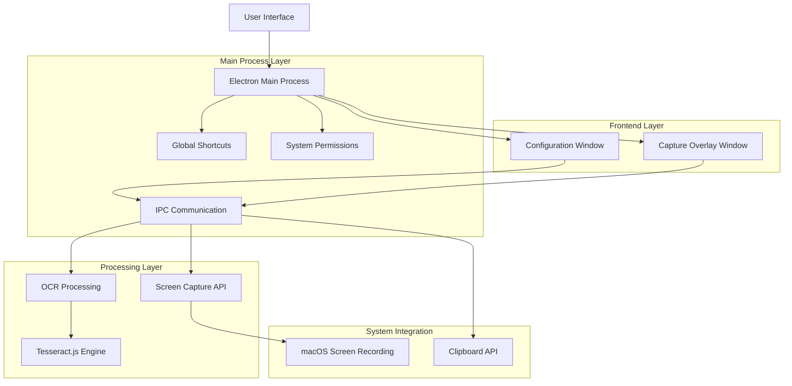
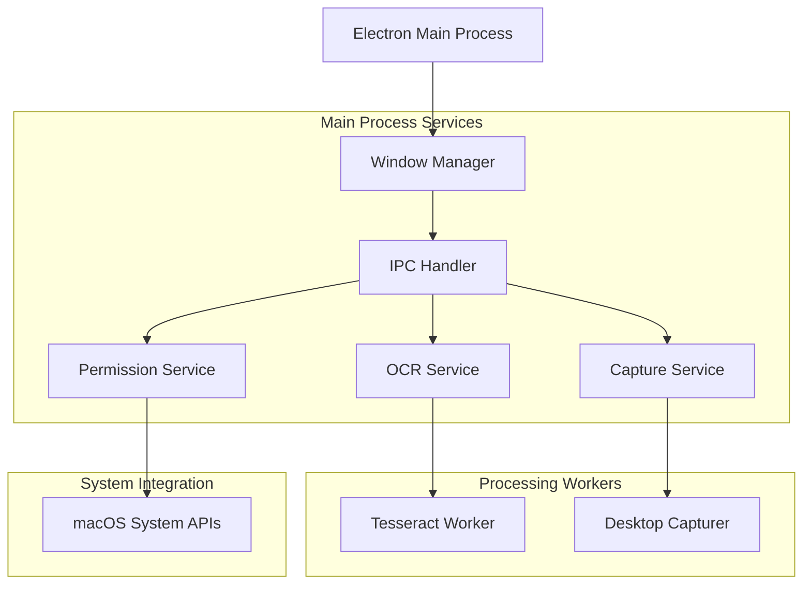
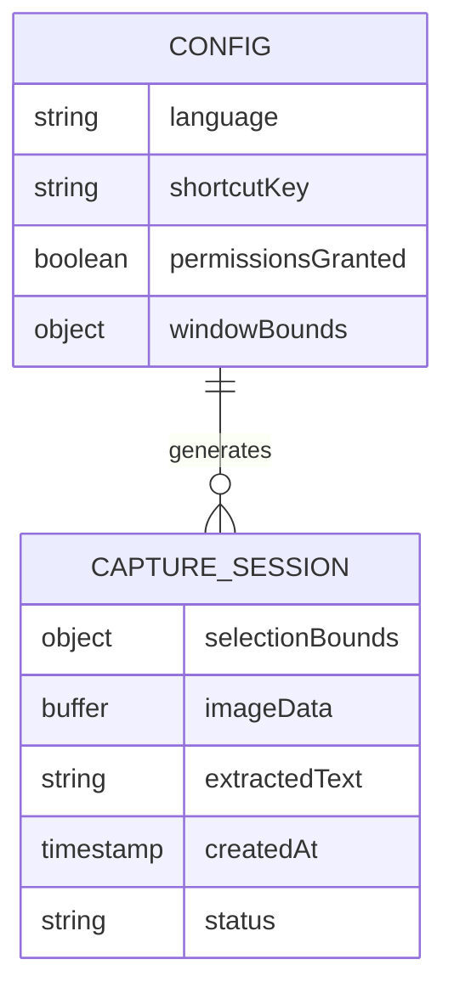

# OCR Screen Capture App - Technical Architecture Document

## 1. Architecture Design



## 2. Technology Description

* Frontend: Electron Renderer Process + HTML5 + CSS3 + Vanilla JavaScript

* Backend: Electron Main Process + Node.js

* OCR Engine: Tesseract.js\@5.0.4

* Screen Capture: Electron desktopCapturer API

* Global Shortcuts: Electron globalShortcut API

* System Integration: macOS Screen Recording permissions

## 3. Route Definitions

| Route         | Purpose                                                               |
| ------------- | --------------------------------------------------------------------- |
| /index.html   | Main configuration window with language settings and capture controls |
| /capture.html | Full-screen area selection overlay for drawing capture regions        |

## 4. API Definitions

### 4.1 Core IPC Communication

**Start Capture Process**

```
IPC: 'start-capture'
```

Direction: Renderer → Main
Description: Initiates screen capture sequence, hides main window and shows selection overlay

**Area Selection Complete**

```
IPC: 'area-selected'
```

Direction: Renderer → Main

Request:

| Param Name | Param Type | isRequired | Description                               |
| ---------- | ---------- | ---------- | ----------------------------------------- |
| bounds     | Object     | true       | Selection area coordinates and dimensions |
| imageData  | Array      | true       | Captured image data as byte array         |

**OCR Processing Status**

```
IPC: 'processing-ocr'
```

Direction: Main → Renderer
Description: Notifies UI that OCR processing has started

**OCR Progress Update**

```
IPC: 'ocr-progress'
```

Direction: Main → Renderer

Response:

| Param Name | Param Type | Description                 |
| ---------- | ---------- | --------------------------- |
| status     | string     | Current processing status   |
| progress   | number     | Completion percentage (0-1) |

**OCR Complete**

```
IPC: 'ocr-complete'
```

Direction: Main → Renderer

Response:

| Param Name | Param Type | Description                        |
| ---------- | ---------- | ---------------------------------- |
| text       | string     | Extracted text from OCR processing |

**Cancel Capture**

```
IPC: 'cancel-capture'
```

Direction: Renderer → Main
Description: Cancels current capture operation and returns to main window

**Global Shortcut Trigger**

```
IPC: 'trigger-capture'
```

Direction: Main → Renderer
Description: Triggered when global shortcut is pressed

## 5. Server Architecture Diagram



## 6. Data Model

### 6.1 Data Model Definition



### 6.2 Data Definition Language

**Configuration Storage (Local Storage)**

```javascript
// Configuration object structure
const config = {
  language: 'eng', // Tesseract language code
  shortcutKey: 'CommandOrControl+Shift+2',
  permissionsGranted: false,
  windowBounds: {
    width: 360,
    height: 480,
    x: null, // Center on screen
    y: null  // Center on screen
  }
};

// Capture session data structure
const captureSession = {
  selectionBounds: {
    x: 100,
    y: 100,
    width: 300,
    height: 200
  },
  imageData: Buffer, // PNG image data
  extractedText: 'Sample extracted text',
  createdAt: new Date().toISOString(),
  status: 'completed' // 'processing', 'completed', 'error'
};

// Supported OCR languages
const supportedLanguages = [
  { code: 'eng', name: 'English', flag: '🇺🇸' },
  { code: 'spa', name: 'Spanish', flag: '🇪🇸' },
  { code: 'fra', name: 'French', flag: '🇫🇷' },
  { code: 'deu', name: 'German', flag: '🇩🇪' },
  { code: 'chi_sim', name: 'Chinese (Simplified)', flag: '🇨🇳' },
  { code: 'jpn', name: 'Japanese', flag: '🇯🇵' },
  { code: 'kor', name: 'Korean', flag: '🇰🇷' },
  { code: 'rus', name: 'Russian', flag: '🇷🇺' },
  { code: 'ara', name: 'Arabic', flag: '🇸🇦' },
  { code: 'hin', name: 'Hindi', flag: '🇮🇳' }
];
```

**macOS Permissions Configuration**

```javascript
// Required permissions for macOS
const requiredPermissions = {
  screenRecording: {
    required: true,
    description: 'Required for capturing screen areas',
    systemPreferencePath: 'Security & Privacy > Privacy > Screen Recording'
  },
  accessibility: {
    required: false,
    description: 'Optional for enhanced global shortcuts',
    systemPreferencePath: 'Security & Privacy > Privacy > Accessibility'
  }
};
```

