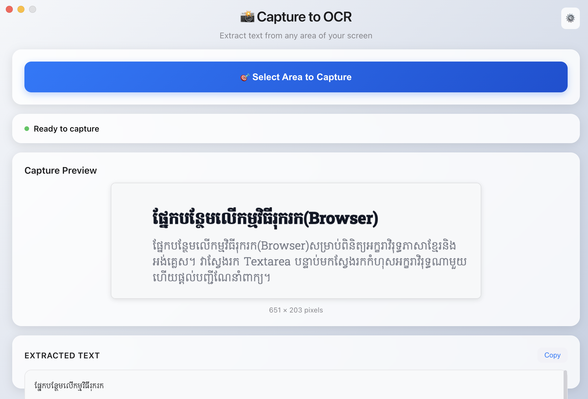

# OCR Screen Capture



## Description

This application allows users to capture a portion of their screen and extract text from it using Optical Character Recognition (OCR). It is built with Electron and Tesseract.js, providing a seamless experience for text extraction directly from your desktop.

## Features

- **Screen Capture**: Easily select any area of your screen to capture.
- **OCR Processing**: Utilizes Tesseract.js for accurate text extraction from captured images.
- **Base64-only Processing**: Efficiently handles image data in-memory without relying on temporary files, improving performance and reducing disk I/O.
- **Cross-Platform**: Built with Electron, making it compatible with various operating systems.
- **Language Support**: Supports multiple languages for OCR, including English and Khmer, with auto-detection capabilities.

## Installation

### Prerequisites

- Node.js (LTS version recommended)
- npm (Node Package Manager)

### Steps

1. **Clone the repository**:

   ```bash
   git clone [repository_url]
   cd ocr-screen-capture
   ```

2. **Install dependencies**:

   ```bash
   npm install
   ```

## Usage

### Development Mode

To run the application in development mode:

```bash
npm run dev
```

### Production Build

To build the application for production:

```bash
npm run build
```

This will generate distributable files (e.g., `.dmg`, `.zip` for macOS) in the `dist` directory.

## Contributing

Contributions are welcome! Please feel free to submit issues or pull requests.

## License

[Specify your license here, e.g., MIT License]
